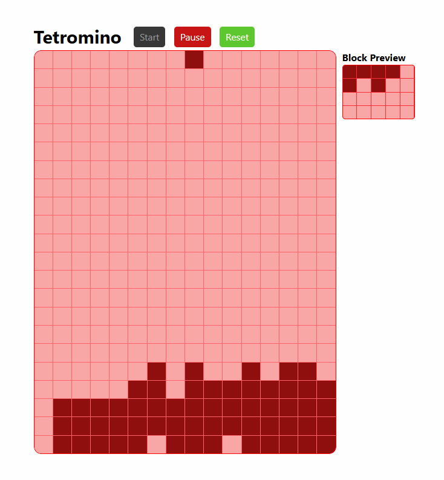

```
该游戏只是自己作为开发者学习所编写的代码，
重点在于学习模块功能归类，
如果该代码能给予阅览者帮助就再好不过了.

This game is just a piece of code written by me as a developer for learning purposes.
The focus is on learning the classification of module functions.
If this code can help readers, that would be even better.
```

### 项目运行 (Project Execution) 

```markdown
npm i
npm run dev
→ http://locahost:5173
```

---

### 无任何关于代码的说明 (No Description Provided)

---
